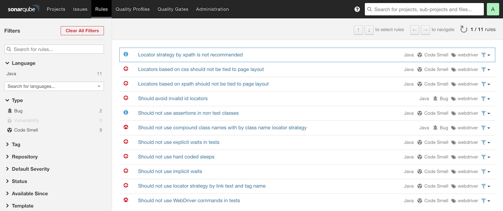
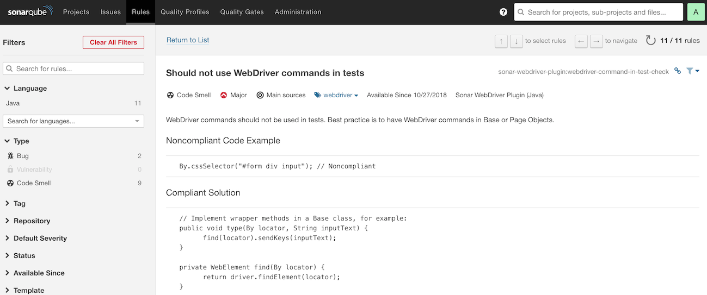
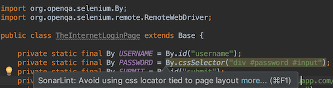

# Sonar WebDriver Plugin

[](https://travis-ci.org/kwoding/sonar-webdriver-plugin)

## Description
The Sonar WebDriver Plugin is a static code analysis tool that helps following best practices for writing WebDriver (Selenium or Appium) tests.

## How to install this plugin
1. Copy `sonar-webdriver-plugin-<version>.jar` to `/path/to/sonarqube/extensions/plugins/` directory of your SonarQube server
2. (Re)start SonarQube

## Scan both main and test sources
Scan code in both `src/main/java` and `src/test/java` in the same Sonar project:
```
mvn sonar:sonar -Dsonar.host.url=http://localhost:9000 -Dsonar.login=<a valid token> -Dsonar.sources=src -Dsonar.test.inclusions=src/test/java
```
## Scan main and test sources separately
Recommended: Scan `src/test/java` code in a separate Sonar project, because metrics like code coverage get thrown off when scanning test code alongside application code (as Sonar will report 0% coverage on all the test classes themselves). To scan separately:

For application code (src/main/java), run:
```
mvn sonar:sonar -Dsonar.host.url=http://localhost:9000 -Dsonar.login=<a valid token>
```

For test code (src/test/java), run:
```
mvn sonar:sonar -Dsonar.projectKey=<my project>-tests -Dsonar.host.url=http://localhost:9000 -Dsonar.login=<a valid token> -Dsonar.sources=src/test -Dsonar.test.inclusions=src/test/java
```
## Quickstart: No SonarQube?
Fastest way to get a local SonarQube server up and running in order to scan code, use the [Docker image](https://hub.docker.com/r/kwoding/sonarqube-webdriver/) which is based on the official SonarQube image to include this plugin.

## How to use SonarLint for instant feedback
For instant feedback while writing code, use [SonarLint](https://www.sonarlint.org/) in your IDE.

1. Set up a project on the local/remote SonarQube server with the WebDriver quality profile enabled.
2. Configure SonarLint to point to the project on your server (e.g. `http://localhost:9000`) using a valid token.
3. That's it!

## Screenshots






